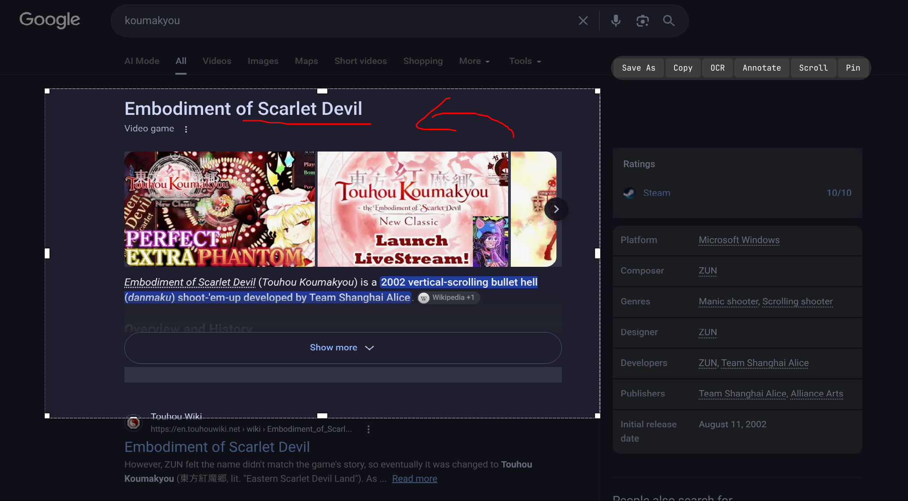

<p align="center">
  
</p>

# OpenPix

A Linux screenshot tool with OCR, scroll capture, and annotation — built in **C++17** on **Qt6 / Wayland**.

OpenPix captures screenshots over the `wlr-screencopy` protocol or the XDG Desktop Portal, stitches long scrolling pages into one image, runs OCR on the result, and lets you annotate and pin captures. It is written against the Wayland protocol specification directly, with per-feature design docs and a `ctest` suite.

## Features

- **Capture** — screen capture via `wlr-screencopy` (Wayland) with the XDG Desktop Portal as fallback.
- **Scroll capture** — stitches a long image from a scrolling surface with flexible, seam-aware stitching.
- **OCR** — on-device inference through ONNX Runtime.
- **Annotation** — toolbar with hotkeys for marking up captures.
- **Pin** — keep captures pinned on screen while you work.
- **Design-first** — every feature has a written design doc under [`docs/plans/`](docs/plans/) before implementation.

## Tech stack

C++17 · Qt6 · Wayland (`wlr-screencopy`, XDG Desktop Portal) · OpenCV · ONNX Runtime · CMake · CTest

## Getting started

Requires Qt6 and its development headers, OpenCV, and ONNX Runtime.

```bash
cmake -B build
cmake --build build -j"$(nproc)"
```

Run the app from `build/`, then run the tests:

```bash
cd build && ctest --output-on-failure
```

## Project layout

- `src/` — application source (capture, stitching, OCR, annotation, pinning)
- `protocols/` — Wayland protocol XML used for `wlr-screencopy`
- `docs/plans/` — one design doc per feature
- `tests/` — CTest suite (stitcher and friends)
